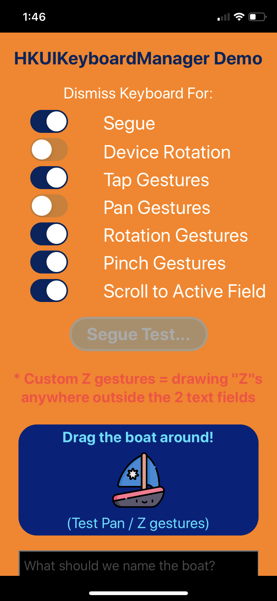
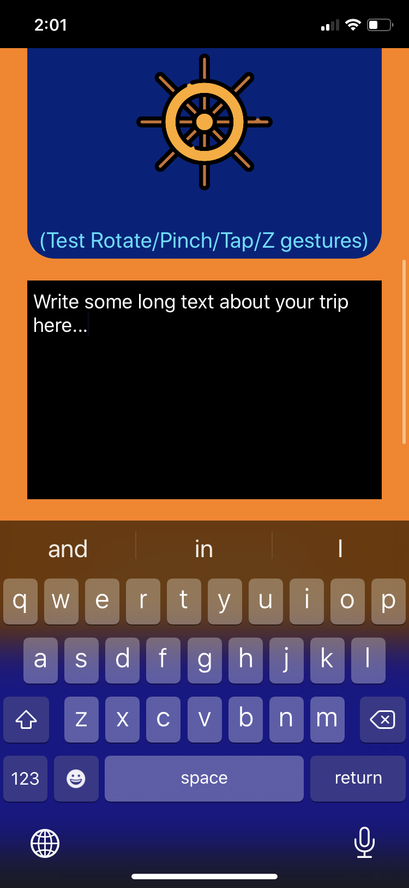
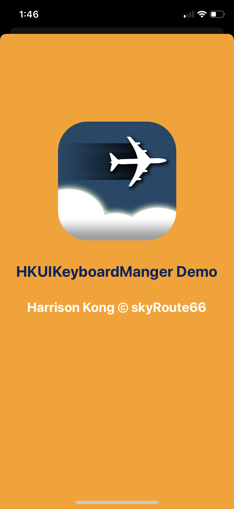

#  HKKBMDemo #
   
#### Demo Application for HKUIKeyboardManager ####

  

## VERSION HISTORY ##

1.0.0 - 2020/01/11 - Initial release

## MINIMUM REQUIREMENTS ##

**Swift** 5.0 or above

**iOS** 13.0 or above

## WHAT IS IT? ##

This is a demo application for `HKUIKeyboardManager`.

For documentation of the module **HKUIKeyboardManager**, go to https://github.com/harrisonkong/HKUIKeyboardManager

## HOW TO INSTALL IT ##

Simply clone the demo application and build and run.
